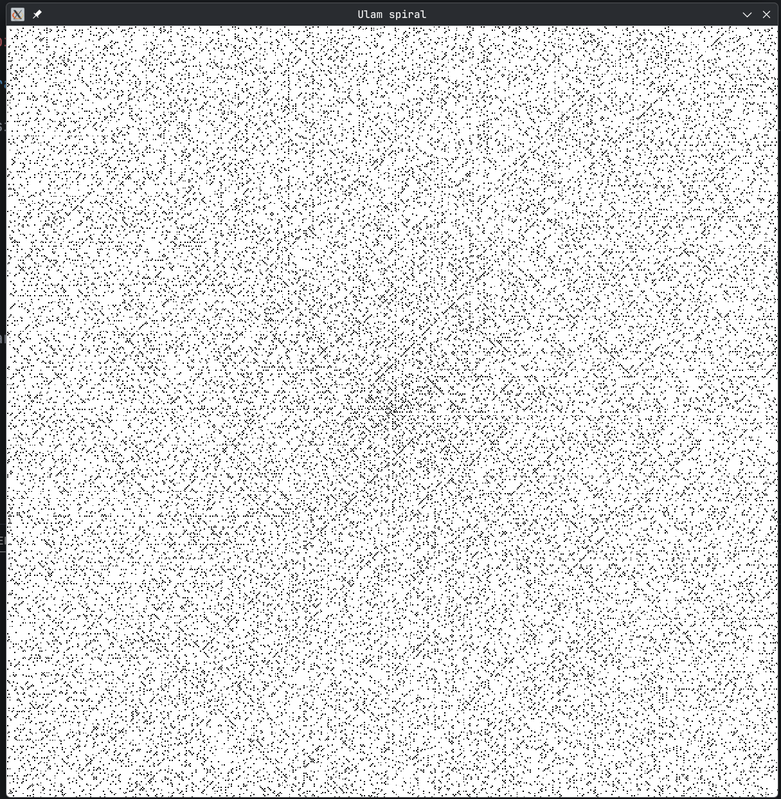

## Ulam Spiral visualization

[Ulam Spiral](https://en.wikipedia.org/wiki/Ulam_spiral) is an interesting pattern created by prime numbers, arranged in a spiral.

I made a simple C program to visualize this pattern. It uses [raylib](https://github.com/raysan5/raylib) so make sure you have it installed.



### Run

```
make run
```

to build and run the program.
